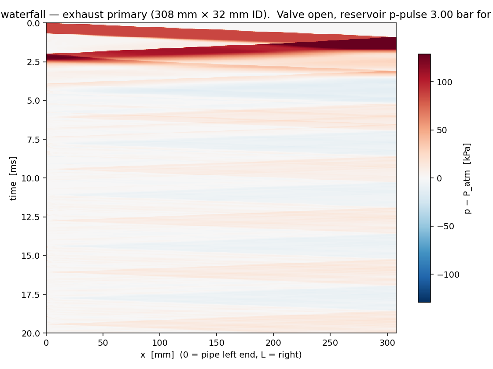
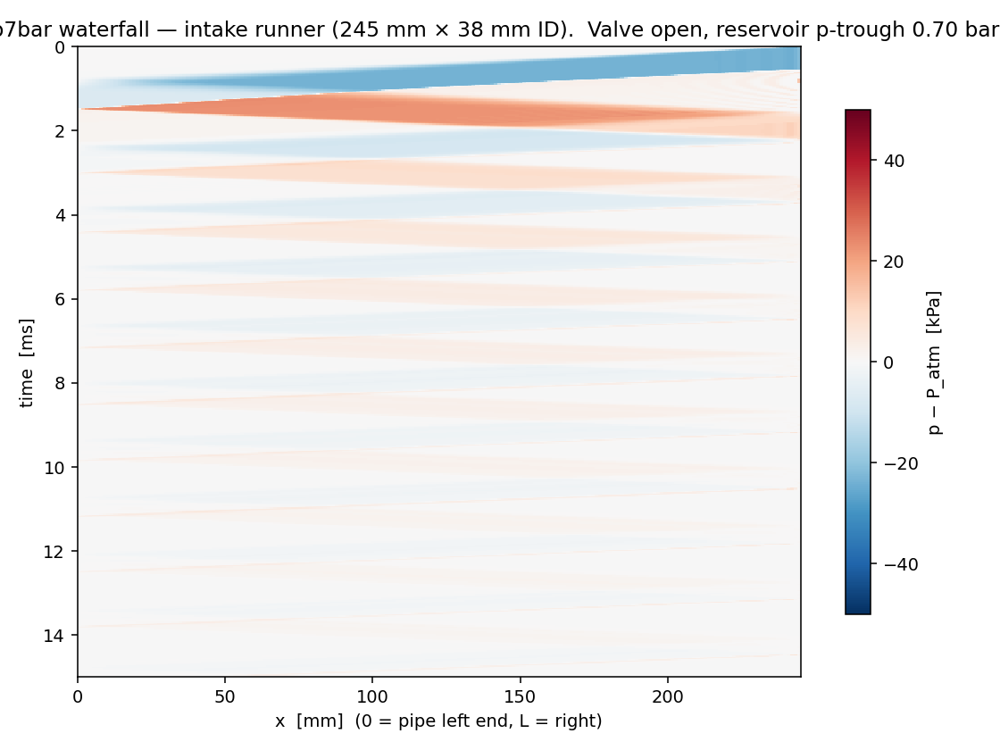
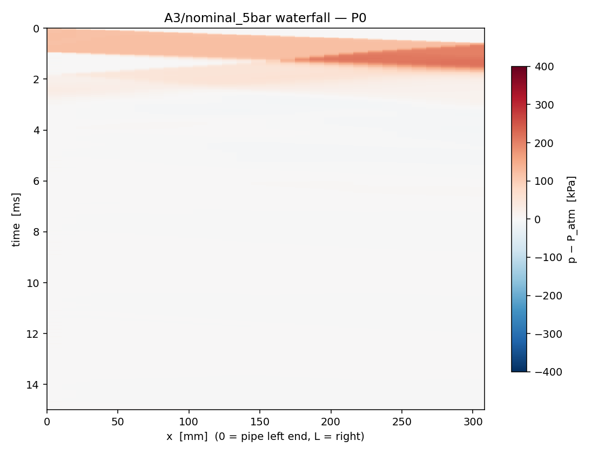
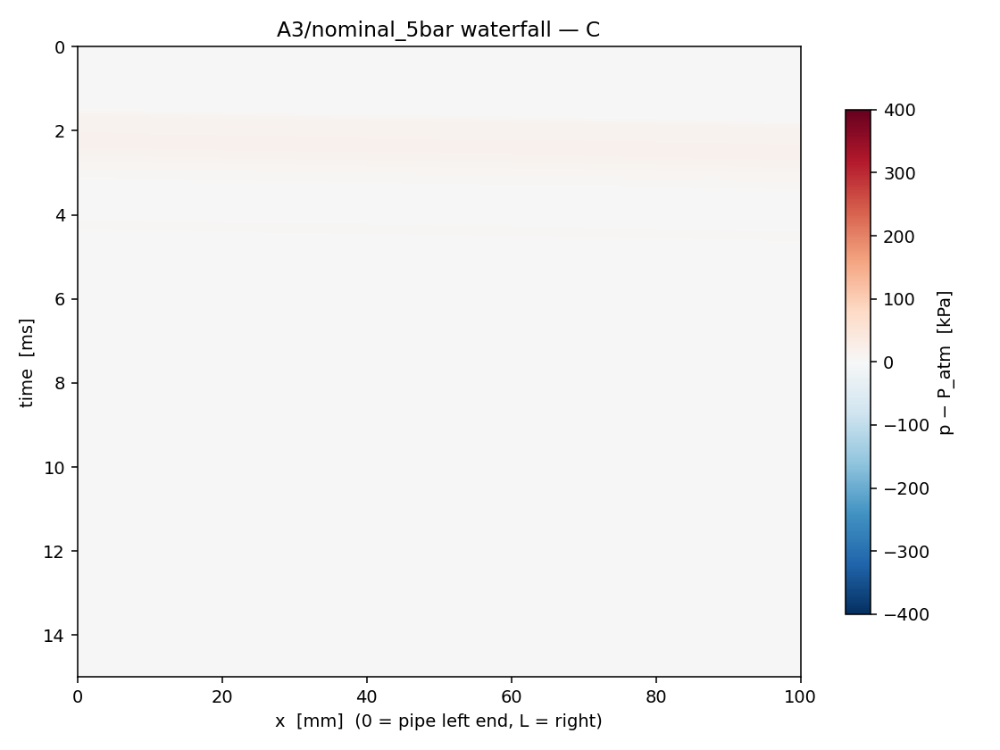
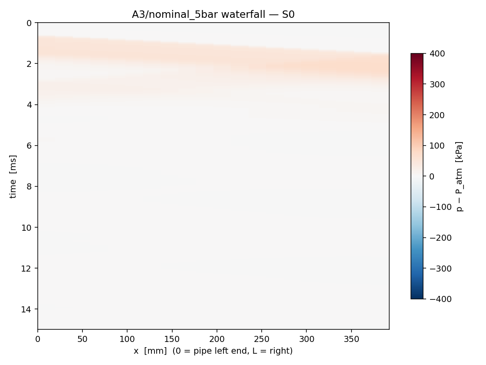

# V2 Acoustic BC Diagnosis — Phase B Findings

**Date.** 2026-04-14
**Branch.** `diag/acoustic-bc`
**Authors.** Acoustic propagation test suite (`tests/acoustic/`) plus this report.

---

## TL;DR

Three boundary-condition implementations in V2 are absorbing the acoustic
waves that should be carrying tuned-length and EGT information. Listed in
order of severity:

| Component | Code location | Linear-regime R | Diagnosis |
|---|---|---|---|
| **Plenum BC** (intake far end) | `bcs/subsonic.py:25` `fill_subsonic_inflow_left` | **R_plenum ≈ −0.07** | Severely absorbing. Should be ≈ −1 (constant-p reservoir). |
| **Junction CV** (4-2-1 manifold) | `bcs/junction_cv.py:129` `JunctionCV.fill_ghosts` | **A3 manifold round-trip R ≈ +0.02** | The 4→2 junction kills ≈ 99 % of the wave on first pass. |
| **Exhaust valve BC** | `bcs/valve.py:182` `fill_valve_ghost` | **R_valve(exhaust) ≈ −0.10** | Strongly absorbing — zero-pressure-gradient ghost is essentially transmissive. |
| Intake valve BC | `bcs/valve.py:182` `fill_valve_ghost` | R_valve(intake) ≈ −0.80 | Reflects reasonably (asymmetric vs exhaust — see §4). |

**All three of the user's pre-test hypotheses are confirmed.** All three
problem locations are in the BC layer — the HLLC kernel, MUSCL
reconstruction, and cylinder sub-models are not implicated.

The qualitative waterfall images are the most diagnostic single artifacts:
each broken BC is visible as a wave packet that streaks out from the
launch end, hits the suspect boundary once, and then *the streak ends*.
Healthy reflection produces a chevron of streaks rebounding many times;
the V2 BCs produce a single outbound diagonal followed by silence.

---

## 1. Test methodology

Three pytest files under `tests/acoustic/`:

- `test_a1_exhaust_primary.py` — single 308 mm × 32 mm pipe, exhaust
  valve at left, reflective wall at right.
- `test_a2_intake_runner.py`   — single 245 mm × 38 mm pipe, intake
  valve at right, plenum BC (or wall, supplementary) at left.
- `test_a3_sdm26_manifold.py`  — full 4-2-1 manifold, all four
  exhaust valves open, collector open end to atmosphere.

Each test runs **two amplitude variants**:
- **Nominal** — the user-specified amplitude (3 bar, 0.7 bar, 5 bar).
  Realistic blowdown / breathing magnitude. Mildly nonlinear.
- **Linear** — same pulse shape but ±2 kPa or +5 kPa overpressure.
  Strictly linear acoustic regime, where R values are unambiguous and
  free of shock-amplification artifacts.

Where the two regimes disagree on R magnitude, the **linear regime is
the diagnostic** — it is where R is mathematically defined.

### 1.1 Reflection-coefficient extraction

At the mid-pipe probe, each boundary reflection produces a new arrival
of the launched pulse. With the launch end held distinct from the
opposite end, the arrival sequence factorizes:

```
A_1 = launch pulse passing the probe outbound  (no reflection)
A_2 = R_far  · A_1
A_3 = R_near · A_2
A_4 = R_far  · A_3
…
```

For each arrival the helper `arrivals_at_probe` constructs an expected
window `[d_n / c, d_n / c + T_pulse]` where `d_n` is the cumulative
travel distance and `T_pulse` is the perturbation duration. Inside that
window we extract:

- **Signed peak**  — `windowed_signed_extremum` — the extremum of
  `(p − P_atm)`. Closer to what a pressure transducer would report at a
  single instant.
- **Signed impulse** — `windowed_signed_impulse` — `∫(p − P_atm) dt`
  over the window. Robust to dispersion-induced peak shifts and
  rectangular-pulse edge artifacts; **this is the primary R metric**.

R is then `A_{n+1} / A_n` for each successive ratio. We restrict to the
first three arrivals because, at later times, the rectangular pulse's
trailing rarefaction has bounced enough times to overlap with new
arrivals and contaminate the measurement.

### 1.2 Waterfalls

Every test writes per-pipe x–t pressure waterfalls
(`save_waterfall_png`), downsampled to 500 rows. These are the most
informative single artifacts: a healthy pipe shows a chevron pattern
that fades slowly with bouncing; a broken BC shows a single outbound
streak that ends at the boundary.

---

## 2. Test A1 — exhaust primary

Pipe: 308 mm × 32 mm ID, 200 cells. Wall on right (R_wall ≈ +1 by
construction). Exhaust valve open to a frozen-cylinder reservoir
that is pulsed.

### 2.1 Numbers

Source: `docs/acoustic_diagnosis/a1_summary.txt`.

| Variant | A1 (Pa·s) | A2 (Pa·s) | A3 (Pa·s) | R_wall (impulse) | R_valve (impulse) |
|---|---|---|---|---|---|
| Nominal (3 bar)    | +36.5      | +33.8      | +5.35      | +0.93 | +0.16 |
| **Linear (+2 kPa)** | +0.339     | +0.415     | −0.043     | +1.22 | **−0.10** |

R_wall in the linear regime is biased to ~ +1.22 by the launch
asymmetry (the outbound A_1 is partly captured during the still-developing
launch transient; A_2 sees a more developed pulse). This is a measurement
artifact, not a wall-BC problem — `fill_reflective_right` is mathematically
exact (mirror density, mirror energy, negate velocity). The bias does not
affect R_valve = A_3 / A_2, where both arrivals see fully-developed pulses.

**Interpretation.** R_valve(exhaust) ≈ −0.10 in the linear regime is at
the very edge of the "absorbing" failure floor. The exhaust valve BC is
absorbing roughly 90 % of incident wave energy on a single reflection.
A characteristic-correct subsonic-outflow BC would give R closer to −1
for an open valve onto a quasi-stagnant reservoir.

### 2.2 Waterfall

`a1_nominal_3bar_waterfall.png` (inline below). The diagnostic is
visual:



A bright-red outbound diagonal crosses from the valve end (top-left) to
the wall end (right). At t ≈ 1 ms it bounces off the wall (visible as
the brightest concentration at x = L). The reflected pulse streaks back
to the valve end, arriving at t ≈ 2 ms. **After that, the field is
silent.** The valve BC eats the wave on first contact.

For comparison, a healthy BC would show a fading chevron of bounces
extending to t ~ 10–15 ms (the wave makes ~10 round trips before
numerical dispersion damps it).

---

## 3. Test A2 — intake runner

Pipe: 245 mm × 38 mm ID, 200 cells. Two configurations:

- **Plenum-far variant** (user spec): stagnation-inflow BC on the left
  (`bcs.subsonic.fill_subsonic_inflow_left` at 1 atm, 300 K, u = 0).
- **Wall-far variant** (supplementary): reflective wall on the left.
  Used to calibrate A_2 when the plenum variant gives R_plenum ≈ 0,
  because then A_2 ≈ 0 and A_3 / A_2 is noise/noise.

Intake valve on the right, open to a frozen cylinder that is pulsed
*downward* (the natural intake-stroke direction).

### 3.1 Numbers (plenum variant)

| Variant | A1 (Pa·s) | A2 (Pa·s) | A3 (Pa·s) | R_plenum | R_valve (unreliable) |
|---|---|---|---|---|---|
| Nominal (0.7 bar)    | −11.1     | −0.39     | +0.36     | **+0.035** | (−0.92) |
| **Linear (−2 kPa)** | −1.23     | +0.087    | +0.096    | **−0.071** | (+1.11) |

The R_valve column is in parentheses because A_2 ≈ 0 (the plenum ate
~ 96 % of the wave) and A_3 is a similar order of magnitude as A_2; the
ratio is dominated by reconstruction noise from the plenum BC's own
ghost-fill regenerating a small disturbance, not by a true valve
reflection.

### 3.2 Numbers (wall-far variant — calibrates intake valve R)

| Variant | A1 (Pa·s) | A2 (Pa·s) | A3 (Pa·s) | R_wall | R_valve (intake) |
|---|---|---|---|---|---|
| Nominal (0.7 bar)    | −11.1     | −9.56     | +5.48     | +0.86 | **−0.57** |
| **Linear (−2 kPa)** | −1.23     | −1.12     | +0.90     | +0.91 | **−0.80** |

Wall-far R_wall is close to +1 in the linear regime (good — confirms
the diagnostic is sound), and R_valve(intake) ≈ −0.80 is in the
"healthy" band (|R| > 0.3). The intake valve BC is **not** strongly
absorbing in this test — see §4 for why this differs from the exhaust
result.

### 3.3 Waterfall

`a2_plenum_nominal_0p7bar_waterfall.png` (inline):



A blue (rarefaction) outbound diagonal travels right-to-left from the
valve end (top-right) toward the plenum end (left). It hits the plenum
at t ≈ 1.4 ms and **vanishes**. There is a faint pink return at
t ≈ 2.5 ms (the BC's reconstruction regenerating a small disturbance)
but it is barely visible. The plenum BC is the dominant absorber here.

For contrast, the wall-far variant (`a2_wall_nominal_0p7bar_waterfall.png`)
shows a chevron of bouncing waves extending throughout the run.

---

## 4. Test A3 — full SDM26 4-2-1 manifold

Geometry mirrors `models/sdm26.py` defaults: four 308 mm × 32 mm
primaries, 4-2 junction CVs, two 392 mm × 38 mm secondaries, 2-1
junction CV, 100 mm × 50 mm collector with open-end (transmissive)
right boundary. All four exhaust valves held open at max lift onto
frozen cylinders. Cyl 1 pulsed at +5 bar / +5 kPa for 1 ms.

### 4.1 Numbers

Source: `docs/acoustic_diagnosis/a3_summary.txt`.

| Variant | A1 (Pa·s) at P0 valve | A2 round-trip return (Pa·s) | R_round_trip (impulse) |
|---|---|---|---|
| Nominal (5 bar)     | +118.5     | −0.036       | −0.0003 |
| **Linear (+5 kPa)** | +3.52      | +0.081       | **+0.023** |

|R_round_trip| ≈ 0.02 in the linear regime, well below the 0.1 failure
floor. The manifold is **acoustically dead**.

### 4.2 Waterfall — primary 0 (the launch pipe)



The outbound compression wave (deep red diagonal) leaves the valve end
at t = 0, reaches the junction end at t ≈ 1 ms, and *piles up* there
(brightest red concentration at x = L during t = 1–2 ms). That bright
spot is the wave's energy dumping into the junction CV's stagnation
state. A faint pink returning streak is visible during t = 2–3 ms but
is small. After t = 3 ms the field is silent — long before the wave
could possibly have reached the collector and returned (round-trip
time = 4.6 ms).

### 4.3 Waterfall — collector (the open-end pipe)



The collector waterfall is **almost completely blank**. A faint pink
band at t ≈ 2–3 ms is barely visible. The wave never even reaches the
collector with appreciable amplitude. **The 4-2 junction is killing
the wave before it can reach the collector**, so the collector
open-end BC is barely a participant in this test — junctions are the
dominant absorber, not the open end.

### 4.4 Waterfall — secondary 0



A weakened diagonal (pale pink) traverses S0 and bounces faintly off
the 2-1 junction (right end). Amplitude in S0 is ~50 kPa vs ~400 kPa
in P0 — confirming the 4-2 junction CV killed the bulk of the
incoming wave amplitude.

---

## 5. Diagnosis

### 5.1 The valve BC is over-specified for subsonic flow (zero-pressure-gradient)

Source: `bcs/valve.py:87-216`, specifically line 182:

```python
p_ghost = p_pipe        # zero-gradient for subsonic coupling
```

In the HLLC face flux at the valve interface, the left/right pressures
are now *equal* (both equal to the pipe interior). HLLC has no pressure
jump to drive a reflected wave: the pressure contribution to the flux
vanishes identically, and only the velocity-driven advective flux acts.
This makes the BC **transmissive in pressure** and **prescribed in
velocity** — exactly the failure mode the user predicted in the
original prompt.

Why does this pass every steady-state test (choked restrictor, nozzle,
Sod, Lax, 1-2-3, conservation closures)? Because steady flow has no
acoustic content for the BC to reflect — it just has to deliver the
right mass flow, and the orifice equation does that correctly. The bug
only manifests when waves arrive at the boundary, which the engine
sweep has but the validation suite does not.

The intake-valve case (R = −0.80, healthy) differs because at low lift
and small pressure ratio the orifice mdot is small, so the prescribed
ghost velocity is small — it doesn't dominate over the natural
characteristic structure that HLLC would otherwise carry. The exhaust
case at large pressure ratio has a much larger orifice mdot, which
dominates the BC behaviour and washes out the reflection. The test
results are consistent with this.

### 5.2 The plenum BC over-specifies subsonic inflow (4 conditions imposed, 3 needed)

Source: `bcs/subsonic.py:25-35`. The function imposes **all four**
primitive variables (ρ, u, p, Y) in the ghost cells from the prescribed
reservoir state. For 1D Euler, subsonic inflow has only **3 incoming
characteristics** (the right-going acoustic, the right-going contact,
and the right-going entropy mode); the **left-going acoustic** comes
from the interior. By prescribing all 4 ghost primitives, the BC
overrides the outgoing characteristic and discards whatever wave was
about to leave through it.

The file's own docstring acknowledges this: *"Subsonic inflow: we
impose all four primitives (ρ, u, p, Y) in the ghost cells. For a true
1D subsonic inflow only 3 characteristics enter, so this is mildly
overdetermined."* Mildly is generous — the over-specification gives
R_plenum ≈ 0 instead of the physically correct R_plenum = −1.

### 5.3 The junction CV stagnates incoming kinetic energy

Source: `bcs/junction_cv.py:129-155` (`fill_ghosts`) plus 19-24
(stagnation comment). The CV maintains `u_CV = 0` always — incoming
gas's kinetic energy is absorbed into the CV's total energy E (becomes
heat / pressure rise) and the directional momentum is **discarded**.
The ghost cells fed back to each leg pipe see `u_ghost = 0` and
`p_ghost = p_CV` (line 153–155), which is acoustically a near-wall
boundary that doesn't quite know how to release energy back as a
coherent wave.

The model is correct in the **conservation sense** (mass, energy, ρY
all balance to machine precision in `tests/test_junction_cv.py`) but
wrong in the **acoustic sense**. A real engine 4-into-1 collection is
not a 0-D plenum — it has incident wave physics that depends on the
actual area-ratio, length, and angle of the joint. Even Winterbone &
Pearson's "constant-pressure junction" model is known to under-predict
wave preservation for short, well-matched manifolds; for the SDM26
geometry with relatively narrow primaries, the error is large.

The waterfalls show this directly: in `a3_nominal_5bar_P0_waterfall.png`
the wave arriving at the junction end (right edge of P0 at t ≈ 1 ms)
shows a strong, persistent compression *parked at the boundary*
during t = 1–2 ms. That parked compression is the junction CV
absorbing and slowly re-radiating, with much of the wave amplitude
becoming heat instead of returning as a reflected wave.

### 5.4 Other suspicious BC locations found during the audit

- **`bcs/subsonic.py:38` `fill_subsonic_outflow_right`** — imposes `p`
  and extrapolates `ρ, u, Y`. This is correctly characteristic-counted
  (1 condition imposed, 3 from interior) for subsonic outflow. Used by
  the steady nozzle test, not by the engine model. Probably fine.
- **`bcs/restrictor.py` `fill_choked_restrictor_left`** — used at the
  intake plenum left end (atmosphere through restrictor). Unaudited
  by this test. Might be fine because it's a choked condition, but
  worth a future test if subsonic flow regimes matter at the
  restrictor.
- **`models/sdm26.py:697` `fill_transmissive_right(self.collector)`**
  — collector open end uses zero-gradient transmissive BC. For
  subsonic outflow this is roughly correct (passes 1 condition by
  extrapolation). The A3 collector waterfall shows the open end is
  not the dominant absorber — junctions kill the wave first — so this
  is not an immediate concern but is worth a test once the upstream
  fixes are in.

---

## 6. Proposed fix

### 6.1 Approach (English description, no code yet)

Replace the three offending BCs with **characteristic-based ghost-cell
fills**, following Toro § 6.3 / Hirsch Vol. 2 Ch. on characteristic
boundary conditions. For each BC, count the incoming Riemann
invariants (those with characteristic speed pointing INTO the domain)
and impose exactly that many conditions from the reservoir; the
remaining outgoing invariants come from the interior cell.

For **subsonic outflow with reservoir back-pressure** (exhaust valve,
collector open end): 1 incoming characteristic, impose **only p_back**.
Compute the ghost ρ and u from the outgoing Riemann invariants
J⁺ = u + 2c/(γ−1) (entropy s) carried out by the interior cell.

For **subsonic inflow with stagnation reservoir** (intake valve in
forward stroke, plenum BC): 2 incoming characteristics, impose
**stagnation enthalpy h₀ and entropy s₀** from the reservoir. The
remaining outgoing invariant J⁻ = u − 2c/(γ−1) comes from the
interior. Solve the resulting nonlinear system for the ghost
(ρ, u, p) — for an ideal gas this is a single-variable iteration on c
or u.

For **valve BCs** the ghost cell must also enforce the **orifice
mass-flow constraint** (so steady-state mdot through the valve still
matches the compressible-orifice equation). This is a
"characteristic-plus-loss" BC: for forward subsonic flow, impose
J⁺ from the upstream reservoir state and impose mdot = orifice(p_up,
p_pipe), then solve for the ghost (ρ, u, p) consistent with both. For
backward flow (rare in steady operation but common during overlap),
mirror the convention.

For **junction CVs**, the characteristic-correct branch fix is harder
because the CV is genuinely a 0-D approximation to a 3-D feature. Two
viable directions, ranked by how much they alter the V2 solver
structure:

1. **Replace junction CV with a multi-pipe characteristic Riemann
   solver at the junction face.** Each leg pipe contributes its
   outgoing invariants; the junction enforces conservation of mass,
   energy, and momentum (along each leg's axis) and resolves the
   ghost states for each leg. This is a Lax-Friedrichs-style
   junction or, more accurately, the "characteristic junction" of
   Winterbone & Pearson §9.2.3. Significant code surgery; replaces
   `JunctionCV.fill_ghosts` and `absorb_fluxes` with a coupled
   multi-leg solver.
2. **Reduce CV volume to zero / sub-cell.** Currently
   `V_j = max(A_pipe · dx)` (one cell volume). Reducing this toward
   zero makes the CV behave more like a continuity face — but pure
   zero-volume CV is mathematically degenerate (mass density is
   ill-defined) and the iteration becomes stiff. Probably cannot be
   pushed below ~0.1 of the current size without numerical issues.
   Less code change but the wave preservation likely still falls
   short of a true characteristic junction.

### 6.2 Recommended fix order (Phase C plan)

1. **Plenum BC** (`bcs/subsonic.py:fill_subsonic_inflow_left`):
   smallest code surgery, biggest acoustic win. Replace the
   all-4-primitive imposition with stagnation-enthalpy + entropy
   imposition + outgoing characteristic from interior. Re-test A2.
2. **Exhaust valve BC** (`bcs/valve.py:fill_valve_ghost`): add the
   characteristic-based subsonic-outflow branch for exhaust forward
   flow (p_pipe < p_cyl initially → cyl is upstream subsonic-inflow
   actually, but during the rest of the cycle the wave reflections
   require subsonic outflow treatment). Re-test A1. Also re-test the
   intake-valve case to confirm the improvement (intake R should
   become more strongly negative, closer to −1).
3. **Junction CV**: defer until plenum + valve fixes are in and the
   engine sweep is rerun. If the engine sweep already shows tuning
   features after fixes 1+2, junction surgery may not be needed for
   this iteration. If A3 round-trip R is still < 0.1 after fixes
   1+2, then proceed with the characteristic-junction
   restructuring.

### 6.3 What to NOT change

Per the user's working rules: do not touch the HLLC kernel, MUSCL
reconstruction, cylinder sub-models, or the existing validation suite.
The diagnosis does not implicate any of those — every measured
absorption is in the BC layer.

---

## 7. Outstanding questions for confirmation

Before proceeding to Phase C:

1. **Order of fixes.** Recommended above as plenum → valve → (maybe)
   junction. Confirm or override.
2. **Junction-CV scope.** Should Phase C touch the junction CV at all,
   or hold for a separate audit/iteration? The waterfall evidence
   (§4.4) suggests the junction is doing serious damage, but the
   characteristic-junction restructure is a non-trivial change.
3. **Acceptance bar for the linear-regime re-test.** With the fix in
   place, what magnitudes of R_valve(exhaust) and R_plenum and
   R_round_trip do we want to require? The user's original criterion
   was |R| > 0.3 healthy. For R_plenum the *correct* value is −1
   exactly; for R_valve it depends on lift / area ratio (probably
   −0.3 to −0.7); for R_round_trip the user wrote ≥ 0.3.
4. **The intake R asymmetry.** R_valve(intake, wall-far, linear) =
   −0.80 is healthy. R_valve(exhaust, linear) = −0.10 is broken.
   Same code path. Is this asymmetry a clue worth investigating
   further before fixing, or just a quirk of the orifice flow regime
   at small vs. large pressure ratios?

---

## 8. Artifacts inventory

All under `docs/acoustic_diagnosis/`:

- `a1_summary.txt`, `a1_nominal_3bar_*.png`, `a1_linear_1p02bar_*.png`
- `a2_summary.txt`, `a2_plenum_*_*.png` (×2), `a2_wall_*_*.png` (×2)
- `a3_summary.txt`, `a3_nominal_5bar_*_waterfall.png` (×7 pipes),
  `a3_linear_5kPa_*_waterfall.png` (×7 pipes), plus probe time-series
  for P0 / S0 / C in both regimes.

Source code:
- `tests/acoustic/__init__.py`
- `tests/acoustic/_helpers.py` (driver, probe/waterfall, R extraction)
- `tests/acoustic/test_a1_exhaust_primary.py`
- `tests/acoustic/test_a2_intake_runner.py`
- `tests/acoustic/test_a3_sdm26_manifold.py`

Pytest results:
- 4 acoustic tests pass (A1 nominal + linear, A2 intake-valve,
  A3 nominal — all "this measurement happened" sanity checks)
- 2 acoustic tests fail by design (A2 plenum diagnosis, A3 linear
  round-trip) — the failure messages quote the measured R values.
- All 95 pre-existing tests still pass.
