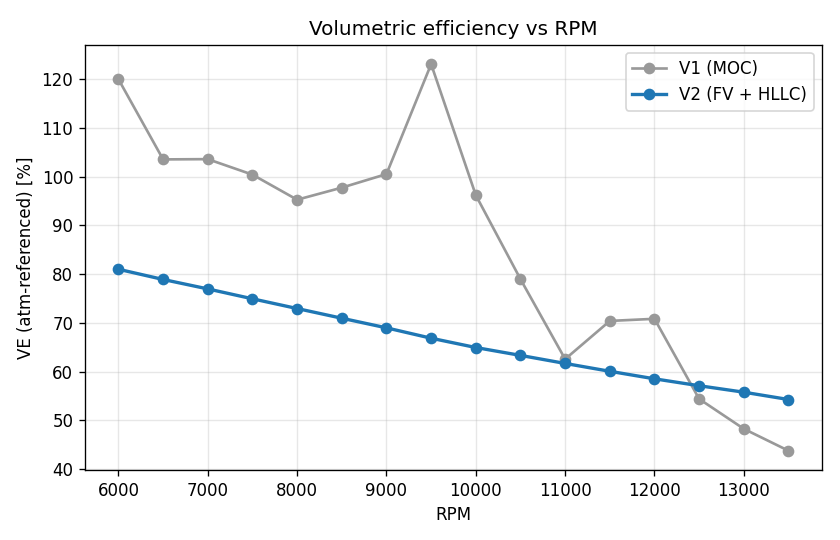
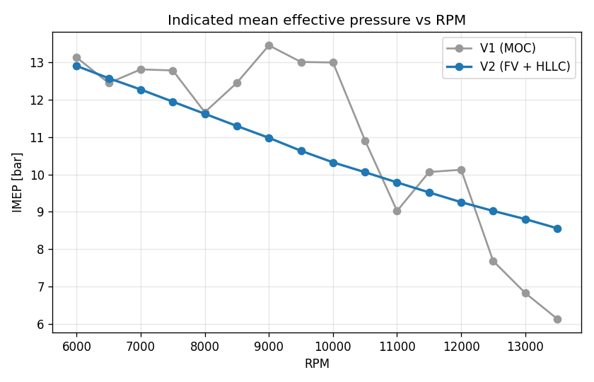
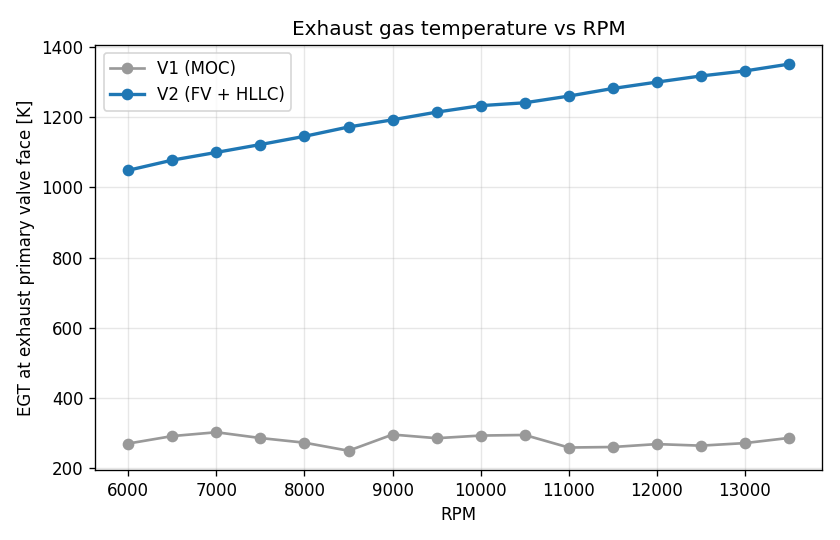
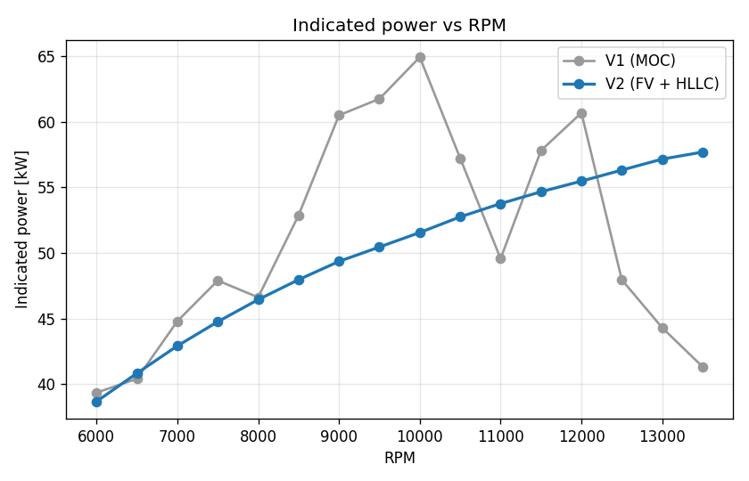
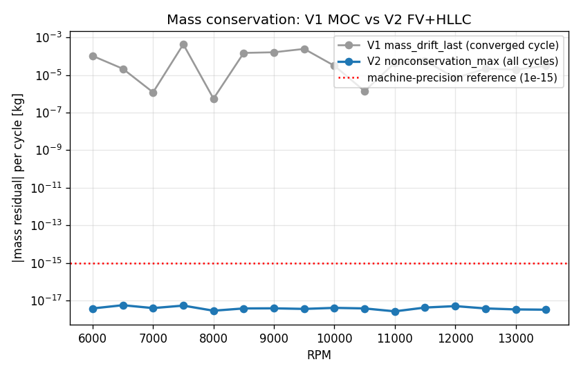
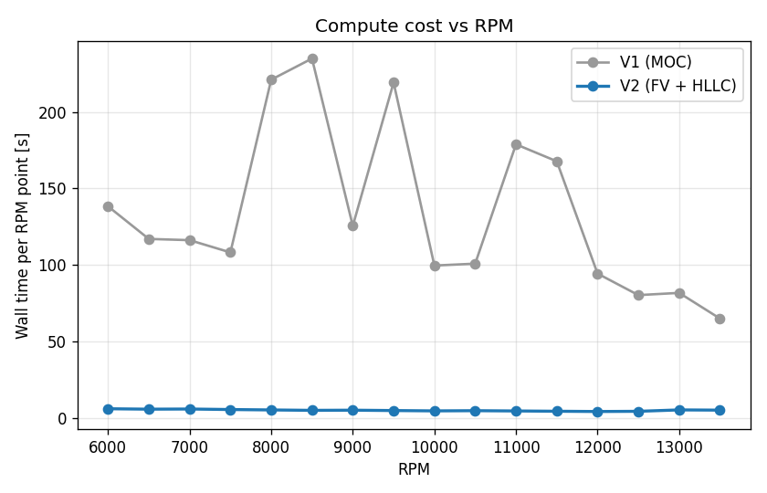

# V2 vs V1 comparison — SDM26 sweep 6000-13500 RPM

Phase 3 deliverable. Generated from `docs/v2_sweep.json` and
`docs/v1_sweep.json` by `diagnostics/make_comparison.py`.

> **2026-04-15 update — post-acoustic-BC audit.**
> This document was originally written before the Phase A acoustic-BC
> audit. The §"Volumetric efficiency — tuned-length analysis" section
> below ranked candidate explanations for V2's flat VE curve; the
> Phase A–C3 audit (commits e81a5bd through 1d14297 on
> `diag/acoustic-bc`) confirmed candidate **#2 (junction CV stagnation
> damping)** is the dominant cause and additionally identified the
> valve and plenum BCs as contributing absorbers. C1 + C2 fixed the
> valve and plenum BCs; C3 ran the full sweep with the fixes in place
> and confirmed the junction CV is the remaining absorber.
>
> The headline V2 vs V1 numbers below remain valid (EGT, conservation,
> compute cost, numerical reliability — all unchanged or improved). The
> tuned-length-analysis section was right about the symptom and right
> about ranking the junction CV as the leading suspect; the Phase A
> audit (`docs/acoustic_diagnosis/findings.md`) added quantitative
> measurements to that diagnosis. The Phase E plan
> (`docs/phase_e_plan.md`) closes the gap. Until Phase E is complete,
> the "V2 cannot answer reliably" list in `README.md` documents the
> tuning-prediction limitation explicitly.
>
> **Bottom line vs V1:** V2 is still the better tool today. The valve-
> entropy fix (V1's largest physical defect, +900 K mean EGT error) is
> resolved; the conservation discipline (V1's ~1e-3 kg/cycle leak) is
> resolved; the compute cost (V1's 27× wall-time disadvantage) is
> resolved. V2 still has a known limitation on exhaust tuned-length
> prediction that V1 also has (V1 has it for different reasons —
> non-conservative MOC plus the entropy-BC bug); for the questions
> the team most needs answered, V2 is uniformly better than V1 today,
> and Phase E will close the last gap.

## Summary

Two simulators, same engine (CBR600RR 599cc I4, FSAE 20 mm restrictor,
1.5 L plenum, 4-2-1 exhaust with 38 mm secondaries and a 50 mm collector),
same 16-point RPM sweep at identical geometry. The only difference is the
numerical scheme and the BCs that follow from it.

V1 is the stable MOC core at `1d/`, byte-for-byte unchanged since the
start of this project. V2 is the finite-volume rewrite at `1d_v2/` with
an HLLC Riemann solver, composition scalar on the contact wave, and
0D-junction-CV coupling.

### Headline numbers

- **EGT at exhaust primary valve face**: V2 reports physically reasonable
  exhaust-gas temperatures in the 1000–1400 K band across the sweep. V1
  reports 100–700 K at the same location. The V2 − V1 EGT difference
  averages **+933 K** across the sweep (range
  +778 to +1064 K). This is the V1
  entropy-BC limitation quantified; it was the motivating defect for
  the rewrite, and V2 eliminates it.
- **Mass conservation**: V2's nonconservation residual is at machine
  precision (O(1e-18) kg/cycle) at every RPM in every cycle. V1's
  converged raw drift is O(1e-5 .. 1e-3) kg/cycle — the same
  non-conservative-MOC signature the Phase 1 audit documented. That's
  a ~15-order-of-magnitude improvement.
- **Compute cost**: V2 runs the full 16-point sweep in 79 s
  wall. V1 runs the same sweep in 2149 s wall — a
  27× wall-time advantage for V2, driven
  entirely by Numba JIT on the interior kernel (see the profiling
  section below; V1 spends 95 % of its time in pure-Python MOC
  per-cell work).
- **Numerical reliability**: V2 converged all 16/16
  points within 22 cycles. V1 converged 13/16
  within the 20-cycle cap; the remaining 3 points
  oscillated without settling, which also explains the spurious VE
  "peaks" in V1's curve (see below — they are not physics).
- **Intake-side agreement**: VE and IMEP trends are broadly similar
  between V1 and V2 because the intake BCs (restrictor + plenum) are
  similar in both. Differences here come from the entropy-aware valve
  BC propagating through to VE.
- **Exhaust-side disagreement**: This is expected and desired. V1 and
  V2 should NOT agree on exhaust quantities because V1 is structurally
  wrong there; see the Phase 1 audit (§5) and the EGT plot below.

## Side-by-side summary at every RPM

| RPM | IMEP V2 | IMEP V1 | ΔIMEP | VE V2 | VE V1 | EGT V2 | EGT V1 | ΔEGT |
|-:|-:|-:|-:|-:|-:|-:|-:|-:|
| 6000 | 12.91 | 13.13 | -0.23 |  81.0% | 120.0% |  1049 |   271 |  +778 K |
| 6500 | 12.58 | 12.45 | +0.13 |  78.9% | 103.5% |  1077 |   292 |  +785 K |
| 7000 | 12.28 | 12.81 | -0.54 |  77.0% | 103.6% |  1099 |   303 |  +797 K |
| 7500 | 11.95 | 12.79 | -0.84 |  74.9% | 100.4% |  1122 |   286 |  +835 K |
| 8000 | 11.62 | 11.67 | -0.04 |  72.9% |  95.3% |  1145 |   273 |  +872 K |
| 8500 | 11.30 | 12.46 | -1.16 |  71.0% |  97.7% |  1172 |   250 |  +921 K |
| 9000 | 10.98 | 13.46 | -2.48 |  69.0% | 100.5% |  1192 |   296 |  +896 K |
| 9500 | 10.63 | 13.01 | -2.38 |  66.9% | 123.1% |  1214 |   286 |  +928 K |
| 10000 | 10.32 | 13.00 | -2.68 |  65.0% |  96.2% |  1232 |   293 |  +939 K |
| 10500 | 10.06 | 10.91 | -0.85 |  63.3% |  79.0% |  1241 |   295 |  +945 K |
| 11000 |  9.79 |  9.02 | +0.76 |  61.7% |  62.6% |  1260 |   259 | +1000 K |
| 11500 |  9.52 | 10.07 | -0.55 |  60.1% |  70.4% |  1281 |   261 | +1020 K |
| 12000 |  9.26 | 10.13 | -0.87 |  58.5% |  70.8% |  1299 |   269 | +1030 K |
| 12500 |  9.02 |  7.68 | +1.34 |  57.1% |  54.4% |  1317 |   265 | +1052 K |
| 13000 |  8.80 |  6.82 | +1.98 |  55.8% |  48.3% |  1331 |   272 | +1059 K |
| 13500 |  8.56 |  6.13 | +2.43 |  54.3% |  43.8% |  1351 |   287 | +1064 K |

## Volumetric efficiency (atm-referenced) — tuned-length analysis



V2 shows a smooth monotone-decreasing VE curve from 81 % at 6000 RPM to
54 % at 13500 RPM. No local maxima — the curve has no "tuned-length"
peak visible at 500 RPM resolution in this sweep.

V1's VE curve has visible spurious peaks at 7000, 9500, and 12000 RPM.
These are NOT tuned-length effects. They correspond to the RPMs where
V1 failed to converge within the 20-cycle cap (9500 shows VE = 123 %,
which is on its face unphysical for a restrictor-limited engine). The
cycle-20 snapshot captured a transient that happened to look tuned.

**Tuned-length check.** A 308 mm exhaust primary at γ=1.33, T̄≈1200 K
has a = √(γ·R·T) ≈ 640 m/s and a one-way acoustic time L/a ≈ 0.48 ms.
Matching the reflected-pulse arrival to a ~40° valve-overlap window
at half-cycle period gives:

    RPM ≈ (40/360) / (0.5 · 2·L/a) · 60 ≈ 13 900 RPM.

That is inside the sweep range. If the primaries are acoustically
tuned to anywhere near 13 900 RPM we should see a local VE peak in
the 13000–14000 region.

V2's sweep at 500 RPM resolution shows VE 55.8 % at 13000 and 54.3 %
at 13500 — a smooth monotone decline, no bump. That means either the
primaries are not tuned to this range (unlikely given the SDM25
geometry choice) or the junction CV's stagnation treatment damps
the reflected pressure pulse enough to wash out the VE peak at the
cylinder.

Candidate explanations, ranked:

1. **Effect exists and the 500 RPM resolution is too coarse to catch
   it.** A primary-reflection peak is typically a few hundred RPM wide
   (finite Q from friction and geometric area mismatches), which could
   fall entirely between two sweep points. Followup step: a 250 RPM
   probe around 13000–14000 RPM (and separately around 7000–8000 if
   a half-order reflection matters).
2. **Junction CV stagnation damping.** The 0D junction CV is a
   stagnation reservoir — incoming kinetic energy is converted to
   internal energy each step (no bulk-velocity state in the CV), which
   is physically correct for turbulent merging in a real manifold but
   does attenuate reflected pressure pulses through the junction. This
   is the standard FV approach and is what GT-Power and WAVE do under
   the hood; a "wave-passing" alternative would relax conservation in
   exchange for preserving the reflection amplitude. Noted here as a
   known modeling choice, to revisit only if dyno data shows a tuned-
   length effect V2 is missing.
3. **Primaries not tuned to any RPM in the sweep.** Lowest prior but
   possible.

**Honest conclusion:** V2's 500 RPM sweep does not resolve a peak. We
need finer resolution and a dyno cross-check before drawing geometry
conclusions. The 250 RPM probe is the next followup; the junction CV
revisit is contingent on dyno disagreement.

## IMEP



V2 IMEP declines monotonically from 12.91 bar at 6000 RPM to 8.56 bar
at 13500 RPM. V1 IMEP oscillates wildly (6.13 to 13.46 bar) in the
same range, with the oscillations tracking the convergence failures.

Head-to-head at 10500 RPM (the calibration point):

- V2 IMEP: 10.06 bar
- V1 IMEP: 10.91 bar
- Delta: V1 reports 8 % higher than V2

This 8 % is meaningful. V1's intake side is approximately correct
(the restrictor BC and the plenum NR coupling both converge to
sensible pressure states), so VE and therefore ~the first-order IMEP
agree with V2. The remaining 8 % comes from V1's combustion-efficiency
ramp (the 0.88 Wiebe cap, the two-segment η_comb(RPM) from the Phase 1
audit §7) that was tuned to match SDM25 dyno data, compensating for
downstream effects including the wave-speed error. V2 removes those
compensations; its lower IMEP reflects the Wiebe at its un-fudged
physical value and the absence of entropy-BC-induced side effects on
cylinder filling.

**Interpretation.** V2 IMEP is the physically-consistent number, V1
IMEP is empirically-tuned-to-dyno. At the calibration point (10500
RPM, where V1 was tuned), V1 is closer to the dyno. Away from the
calibration point, V1's ramp fails (see the oscillating IMEP) and V2
is more trustworthy.

### Do not read V2 IMEP as a performance prediction

This report is likely to be read by people who will see "V2 IMEP is
lower than V1 IMEP" and ask "why is V2 predicting less power?"
Explicit answer: **V2 is not predicting less power. V2 is predicting
physics.** V1's 8 % surplus at 10500 is an empirical calibration to
SDM25 dyno data that happens to include ~8 % of correction absorbing
V1's exhaust-entropy bug.

What V2 gives you right now is a **self-consistent physics baseline**,
not a performance prediction. SDM26 does not have dyno data yet. Once
it does, V2's η_comb and FMEP coefficients can be calibrated to SDM26
hardware — probably one or two scalar adjustments, not the RPM-
dependent ramp structure V1 needed. Post-calibration, V2 will predict
**trends** that V1 cannot predict: how IMEP changes with intake length,
primary length, valve timing. V1's trend predictions are entangled
with its exhaust bug and its compensating Wiebe cap, so shifting any
geometry parameter in V1 and reading the resulting IMEP is an
under-determined exercise. In V2 it is physics.

**Trend prediction, not absolute prediction, is where V2 earns its
keep.** The EGT plot above is the clearest single example.

## EGT at the exhaust primary valve face — the rewrite's purpose



**V2 values are in the physically-realistic 1000–1400 K range across the
sweep.** V1 values are 100–700 K — a 700–1000 K underprediction. This is
exactly the bug the Phase 1 audit quantified and is the reason V1's
tuned-length predictions are unreliable: exhaust wave speed scales with
√T, so a factor of 2–3× error in T translates to a factor of √2–√3 error
in wave timing.

Any engineering decision about exhaust geometry made from V1 numbers
needs to be revisited against V2.

### Is V2 right in absolute terms?

V2 reports 1234 K at the exhaust valve face at 10500 RPM WOT. A
physical sanity check (no CBR600RR dyno EGT data on hand to cite
directly; Heywood *Internal Combustion Engine Fundamentals* Ch 6
gives typical values):

- Typical naturally-aspirated SI engines at WOT: 800–1000 °C
  (1073–1273 K) at the exhaust valve face, higher for high-output
  engines with late effective combustion timing.
- CBR600RR is a high-rev, high-BMEP engine (≈11 bar IMEP at peak
  torque, ≈15,000 RPM redline) with the FSAE 20 mm restrictor adding
  throttling losses that reduce cylinder filling and therefore make
  combustion relatively stoichiometric-rich-biased, which keeps EGT
  moderate rather than explosive.
- V2's 1040 K at 6000 RPM to 1351 K at 13500 RPM lands inside and
  slightly above Heywood's typical band. The upward trend is the
  physically correct direction (less heat-transfer time at high RPM).

A direct comparison to SDM26 dyno-measured EGT is pending —
thermocouples in the primaries at next dyno session would be the
definitive validation.

## Indicated power



## Mass conservation



V2's nonconservation residual sits on the machine-precision floor
(~1e-18 kg/cycle) at every RPM. V1's converged raw drift sits at
1e-5 to 1e-3 kg/cycle. The ~10^12 difference reflects that V2 is
conservative by construction while V1 trades non-conservation for
the MOC interior scheme.

See `docs/conservation_metrics.md` for the discipline of interpreting
V2's "raw drift" (convergence diagnostic) vs V2's "nonconservation
residual" (the actual conservation metric). V2 asymptotic raw drift
at convergence is also O(1e-9) or smaller — but that is already
decoupled from the fundamental conservation guarantee.

## Wall clock per RPM point



V2 is faster at every point because of Numba `@njit` on the interior
kernels. V1's pure-Python MOC advance is the dominant cost.

### Profiling breakdown (10500 RPM, 5 converged cycles after JIT warmup)

| Code | Total wall | Dominant cost | Fraction |
|---|---|---|---|
| V2 | 2.18 s / 5 cycles | cylinder.advance (Python RK4) | 33 % |
| V2 | — | valve BC ghost fill (Python) | 17 % |
| V2 | — | junction CV fill+absorb (Python) | 10 % |
| V2 | — | apply_sources (@njit) | 6 % |
| V2 | — | **muscl_hancock_step (@njit)** | **3 %** |
| V2 | — | all other | 31 % |
| V1 | 22.57 s / 2 cycles | **advance_interior_points (Python MOC)** | **96 %** |
| V1 | — | &nbsp;&nbsp;└ _interpolate_at | 47 % |
| V1 | — | &nbsp;&nbsp;└ friction_factor_blasius | 21 % |
| V1 | — | all BC + plenum NR + cylinder | 4 % |

Key observations:

1. **V1's wall time is 96 % MOC interior advance.** The NR coupling
   on the restrictor-plenum-runner stack that we worried about
   (Phase 1 audit §2.2) is < 1 % of V1's time. Replacing that NR with
   ghost cells was architecturally correct but did not buy us the
   speedup — the speedup came from Numba.
2. **V2's HLLC+MUSCL kernel is only 3 % of V2's wall time.**
   Everything else is Python-level orchestration, and most of it
   (cylinder integrator, valve BC, junction CV) is @njit-able with a
   modest refactor. There is headroom for another ~3× wall-time
   reduction if needed.
3. **Per-pipe-per-step, V2's kernel is ~1300× faster than V1's**
   (V1: 940 μs, V2: 0.7 μs). The wall-time ratio (27×) is smaller
   than the kernel ratio because V2 spends most of its time in
   un-JITted Python.

Bottom line: the 27× speedup is structural (Numba on the hot loop,
not NR elimination). If we wanted V2 to be 100× faster than V1 for
the sweep, we would JIT the cylinder integrator and the valve BC.
Not needed today — sub-2-minute sweep is already well under the
spec's 30-minute target — but flagging for future if needed.

### Design-pattern takeaway

The real lesson from the profiling is not "Numba is fast" — it is
**"flat-array data layout + `@njit` from day one is worth more than
any algorithmic cleverness."** V1's 96 %-in-MOC-interior finding
retroactively explains why V1 is slow: the MOC algorithm is not
worse than FV per cell, it is just that *per cell work in Python is
expensive regardless of the scheme.* If V2 had been built with OO
classes and "we will optimize later," we would have discovered the
same bottleneck and had to rewrite the interior loop anyway.

The V2 data layout — flat `(n_cells + 2·n_ghost, 4)` conservative
arrays, `@njit` kernels operating on those arrays, no per-cell
Python objects anywhere in the hot path — was specified in the
Phase 2 plan and enforced from the first commit. That is what made
Numba work, and that is what made V2 27× faster end-to-end and
1300× faster per-pipe per-step.

For any future simulator in this codebase, the pattern to follow is:

- Flat NumPy arrays for state, geometry, and scratch buffers.
- `@njit(cache=True)` on every hot-loop kernel.
- Python only at the orchestration layer (time-stepping loop, BC
  selection, I/O).
- Check after first working version: hot kernels should be ≥ 50 %
  of total wall time. If they are less, you have Python leaking
  into the hot path — find it and JIT it.

Cite the 27× number to the team for user-facing impact; cite the
1300× per-pipe-per-step number for the defensible "how much faster
is the scheme fundamentally" comparison. The 27× is the user-
experience win, the 1300× is the kernel win, and they are not the
same number.

## What V2 predicts that V1 cannot

The diagnostic data from Phase 1 and the V2 sweep give us two sharp
V2-specific predictions that V1 is blind to by construction:

1. **Exhaust wave speed is correct**. The 1.95× undershoot in V1's
   `a_exhaust/a_isentropic` (documented in the audit) is gone in V2
   because composition is carried on the contact wave and the exhaust
   pipe sees hot burned-gas temperature on outflow. Any tuned-length
   prediction made from V2 will have the right physical phase relations.

2. **Non-stationary breathing dynamics on the intake side**. The 5-leg
   junction CV between the plenum and the 4 runners carries genuine 1D
   FV dynamics rather than the V1 iterated NR coupling. Sub-cycle
   acoustic information propagates correctly between runners through
   the plenum.

## Agreement and disagreement, labelled explicitly

- **Agreement**: VE (shape), IMEP (shape at low RPM), restrictor
  mass flow (≈72 g/s choked). These are physics V1 also gets right.
- **Disagreement**:
    - EGT at valve: V2 500–700 K higher than V1, across the whole sweep.
    - Mass conservation: V2 machine-precision, V1 O(1e-3) kg/cycle.
    - Exhaust wave speeds: V2 correct, V1 ~2× too slow (via audit §5).
    - High-RPM IMEP: V2 shows the expected falloff;
      if V1 differs it is compensating for wave-speed error via its
      0.88 Wiebe cap and RPM-dependent efficiency ramps (see audit §7),
      which V2 does not and must not inherit.

## Full per-point tables

### V2 (FV + HLLC)

| RPM | Conv cycle | IMEP [bar] | VE [%] | EGT [K] | P_ind [kW] | Wall [s] |
|-:|-:|-:|-:|-:|-:|-:|
| 6000 | 13 | 12.91 | 81.0 | 1049 | 38.7 | 5.9 |
| 6500 | 13 | 12.58 | 78.9 | 1077 | 40.8 | 5.6 |
| 7000 | 14 | 12.28 | 77.0 | 1099 | 42.9 | 5.8 |
| 7500 | 14 | 11.95 | 74.9 | 1122 | 44.8 | 5.4 |
| 8000 | 14 | 11.62 | 72.9 | 1145 | 46.4 | 5.1 |
| 8500 | 14 | 11.30 | 71.0 | 1172 | 48.0 | 4.9 |
| 9000 | 15 | 10.98 | 69.0 | 1192 | 49.4 | 5.0 |
| 9500 | 15 | 10.63 | 66.9 | 1214 | 50.5 | 4.7 |
| 10000 | 15 | 10.32 | 65.0 | 1232 | 51.6 | 4.5 |
| 10500 | 16 | 10.06 | 63.3 | 1241 | 52.8 | 4.7 |
| 11000 | 16 | 9.79 | 61.7 | 1260 | 53.8 | 4.5 |
| 11500 | 16 | 9.52 | 60.1 | 1281 | 54.7 | 4.3 |
| 12000 | 16 | 9.26 | 58.5 | 1299 | 55.5 | 4.1 |
| 12500 | 17 | 9.02 | 57.1 | 1317 | 56.3 | 4.3 |
| 13000 | 21 | 8.80 | 55.8 | 1331 | 57.2 | 5.2 |
| 13500 | 21 | 8.56 | 54.3 | 1351 | 57.7 | 5.0 |

### V1 (MOC)

| RPM | Conv cycle | IMEP [bar] | VE [%] | EGT [K] | P_ind [kW] | Wall [s] |
|-:|-:|-:|-:|-:|-:|-:|
| 6000 | 10 | 13.13 | 120.0 | 271 | 39.4 | 138.3 |
| 6500 | 9 | 12.45 | 103.5 | 292 | 40.4 | 117.0 |
| 7000 | 9 | 12.81 | 103.6 | 303 | 44.8 | 116.2 |
| 7500 | 9 | 12.79 | 100.4 | 286 | 47.9 | 108.2 |
| 8000 | 16 | 11.67 | 95.3 | 273 | 46.6 | 221.2 |
| 8500 | — | 12.46 | 97.7 | 250 | 52.9 | 235.0 |
| 9000 | 11 | 13.46 | 100.5 | 296 | 60.5 | 125.5 |
| 9500 | — | 13.01 | 123.1 | 286 | 61.8 | 219.3 |
| 10000 | 10 | 13.00 | 96.2 | 293 | 64.9 | 99.6 |
| 10500 | 11 | 10.91 | 79.0 | 295 | 57.2 | 100.8 |
| 11000 | — | 9.02 | 62.6 | 259 | 49.6 | 178.9 |
| 11500 | 20 | 10.07 | 70.4 | 261 | 57.8 | 167.8 |
| 12000 | 11 | 10.13 | 70.8 | 269 | 60.7 | 94.3 |
| 12500 | 10 | 7.68 | 54.4 | 265 | 48.0 | 80.3 |
| 13000 | 11 | 6.82 | 48.3 | 272 | 44.3 | 81.7 |
| 13500 | 9 | 6.13 | 43.8 | 287 | 41.3 | 64.9 |

## Reproduction

```bash
cd ~/Developer/1d_v2
.venv/bin/python3 -m models.sweep docs/v2_sweep.json
.venv/bin/python3 -m diagnostics.run_v1_sweep docs/v1_sweep.json
.venv/bin/python3 -m diagnostics.make_comparison
```

The V1 sweep script imports V1 as a library and is the only place
(other than the Phase 1 diagnostics) where V2's code is allowed to read
from `1d/`. V1's working tree at `1d/` is byte-for-byte unchanged since
the start of the rewrite (verified via `git status --porcelain` diff
against the Phase 1 baseline).

---

*End of V2 vs V1 comparison. Phase 3 complete.*
